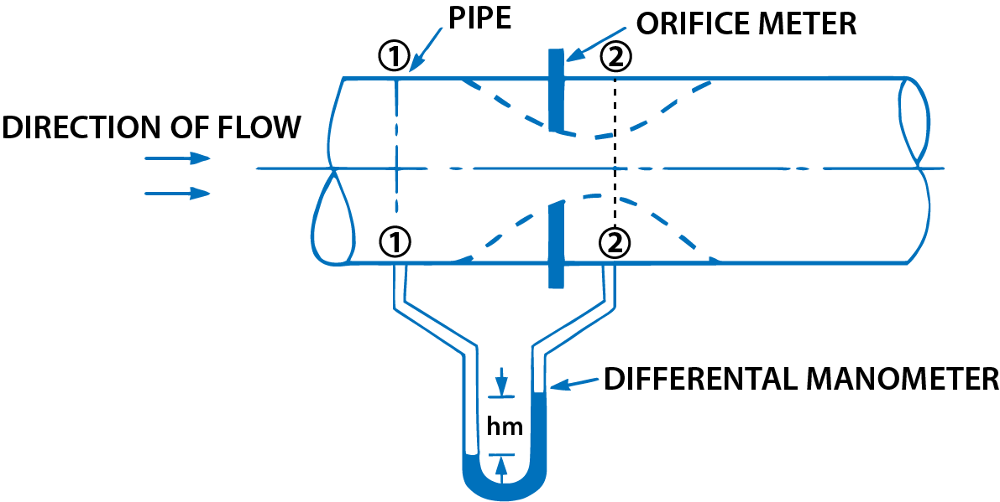

<h2>Orifice meter or Orifice plate</h2>

It is a device used for measuring the rate of flow of a fluid through a pipe. It is a cheaper device as compared to venturimeter. It also works on the same principle as that of venturimeter. It consists of a flat circular plate which has a circular sharp edged hole called orifice, which is concentric with the pipe. The orifice diameter is kept generally 0.5 times the diameter of the pipe, though it may vary from 0.4 to 0.8 times the pipe diameter. 

 A differential manometer is connected at section (1), which is at a distance of about 1.5 to 2.0 times the pipe diameter upstream from the orifice plate, and at section (2), which is at a distance of about half the diameter of the orifice on the downstream side from the orifice plate.

Let

&emsp; p1 = pressure at section (1),  
&emsp; V1 = velocity at section (1),  
&emsp; a1 = area of pipe at section (1), and  

figure 1:Orifice meter

  

p2, v2, a2 are corresponsing values at section(2). Applying Bernoulli's equations at section (1) and (2) we get

$$ \frac{p_1}{\rho_{g}} + \frac{v_1^2}{2g} + z_1 = \frac{p_2}{\rho_{g}} + \frac{v_2^2}{2g} + z_2 $$ 

Or

$$ \left(\frac{p_1}{\rho_{g}}  + z_1 \right)  - \left(\frac{p_2}{\rho_{g}} + z_2 \right) = \frac{v_2^2}{2g}  - \frac{v_1^2}{2g} $$ 

But

$$ \left(\frac{p_1}{\rho_{g}}  + z_1 \right)  - \left(\frac{p_2}{\rho_{g}} + z_2 \right) = \ h \ = \ Differential \ head $$ 

$$ \therefore \ \ \ \  h = \frac{v_2^2}{2g}  - \frac{v_1^2}{2g} \ \ or \ \ 2gh = v_2^2 - v_1^2  $$ 

Or

$$ v_2 = \sqrt{2gh + v_1^2} \ \ \ \ \ \ \ \ ...(i) $$ 

Now section (2) is at the vena-contracta and a2 represents the area at the vena-contracta. Id a0 is the area of orifice then we have 

$$ C_c = \frac{a_2}{a_0} $$ 

 Where Cc = co-efficient of contraction

$$ \therefore \ \ \ \  a_2 = a_0 \times C_c  \ \ \ \ \ \ ...(ii)$$ 

 By continuity equation, we have 

$$ a_1v_1 = a_2v_2 \ or \ v_1 = \frac{a_2}{a_1}v_2 = \frac{a_0C_c}{a_1}v_2  \ \ \ \ \ \ ...(iii)$$ 

 Susbtituting the value of v1 in equation (i), we get

$$ v_2 = \sqrt{2gh + \frac{a_0^2C_c^2v_2^2}{a_1^2}} $$

Or

$$ v_2^2 = 2gh + \left( \frac{a_0}{a_1} \right)^2 C_c^2v_2^2 \ \ or \ \ v_2^2 = \left[ 1 - \left( \frac{a_0}{a_1} \right)^2 C_c^2 \right] = 2gh  $$

$$ \therefore \ \ \ \ v_2 = \frac{\sqrt{2gh}}{\sqrt{1 - \left( \frac{a_0}{a_1} \right)^2 C_c^2}} $$

&therefore; The discharge Q = v2 x a2 = v2 x a0 Cc 

$$  = \frac{a_0C_c \sqrt{2gh}}{\sqrt{1 - \left( \frac{a_0}{a_1} \right)^2 C_c^2}} \ \ \ \ \ \ ...(iv)$$ 

 The above expression can be simplified by using: 

$$  C_d = C_c \frac{\sqrt{1 - \left( \frac{a_0}{a_1} \right)^2}}{\sqrt{1 - \left( \frac{a_0}{a_1} \right)^2 C_c^2}} $$ 

$$  C_c = C_d \frac{\sqrt{1 - \left( \frac{a_0}{a_1} \right)^2 C_c^2}}{\sqrt{1 - \left( \frac{a_0}{a_1} \right)^2}} $$ 

Substituting this value of Cc in equation (iv), we get

$$  Q = a_0 \times C_d \frac{\sqrt{1 - \left( \frac{a_0}{a_1} \right)^2 C_c^2}}{\sqrt{1 - \left( \frac{a_0}{a_1} \right)^2}} \times \frac{\sqrt{2gh}}{\sqrt{1 - \left( \frac{a_0}{a_1} \right)^2 C_c^2}} $$ 

$$  = \frac{C_da_0\sqrt{2gh}}{\sqrt{1 - \left( \frac{a_0}{a_1} \right)^2}} = \frac{C_da_0a_1\sqrt{2gh}}{\sqrt{a_1^2 - a_0^2}} $$ 

where, Cd = cp-efficient of discharge for orifice meter.

The co-efficient of discharge for orifice meter is much smaller than that for a venturimeter.
